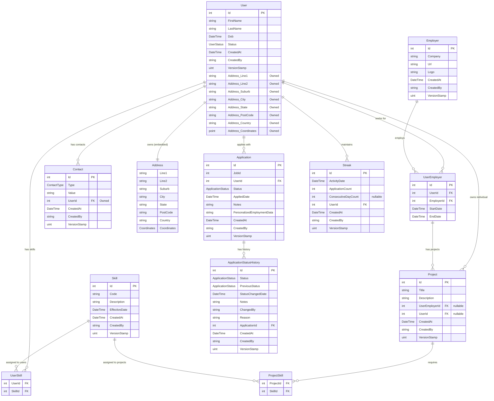

# Database Diagram

## Enums

### UserStatus
| Value | Description |
|-------|-------------|
| Active | User is active |
| Inactive | User is inactive |
| Suspended | User is suspended |
| Pending | User registration pending |

### ApplicationStatus
| Value | Description |
|-------|-------------|
| Applied | Application submitted |
| UnderReview | Under review by employer |
| Shortlisted | Candidate shortlisted |
| Interviewed | Candidate interviewed |
| Accepted | Application accepted |
| Rejected | Application rejected |
| Withdrawn | Application withdrawn by user |
| Saved | Application saved (draft) |
| Archived | Application archived |

### ContactType
| Value | Description |
|-------|-------------|
| Email | Email address |
| Phone | Phone number |
| Mobile | Mobile number |

## Notes

- **Address** is an owned entity embedded in the `User` table (columns prefixed with `Address_`)
- **Contact** is an owned collection stored in a separate `user_contacts` table
- **UserSkill** and **ProjectSkill** are join tables for many-to-many relationships
- **Project** can belong to either a `UserEmployer` (employment project) or directly to a `User` (individual project)
- All entities inherit audit fields: `CreatedAt`, `CreatedBy`, `VersionStamp`

