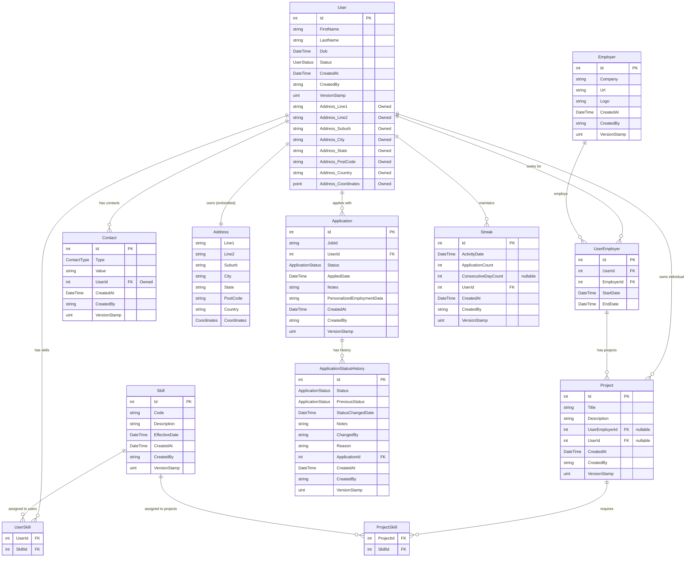

# Krypton.Carevo.UMR

Unified Member Record (UMR) service for Carevo.

---

## Architecture

This project follows a **Clean Architecture** pattern, enforcing a strict separation of concerns across layers. Each layer has a well-defined responsibility and a controlled set of dependencies — outer layers depend inward, never the reverse.


> *Diagram reference: [Clean Architecture with .NET — Chapter 1](https://learning.oreilly.com/library/view/clean-architecture-with/9780138203443/ch01.xhtml#ch01lev1sec3)*

### Layer Overview

| Project | Role |
|---|---|
| `Kr.Carevo.UMR.Domain` | Core business models, aggregates, value objects, DTOs, repository ports |
| `Kr.Carevo.UMR.Application` | Use cases, CQRS handlers, service orchestration |
| `Kr.Carevo.UMR.Persistence` | EF Core data layer — DbContext, migrations, repository implementations |
| `Kr.Carevo.UMR.Infrastructure` | External concerns — HTTP clients, caching, auth, eventing |
| `Kr.Carevo.UMR.Api` | ASP.NET Core host — endpoints, DI composition root, configuration |

The `Domain` layer has **zero dependencies** on any other project layer. All other layers depend inward toward `Domain`, never across or outward.

---

## Domain Layer — Aggregates & Value Objects

The domain model lives in `Kr.Carevo.UMR.Domain/Models/AggregateModels/` and is organised around **DDD aggregate roots**.

In DDD, the aggregate root is the single entry point to a cluster of related objects. All interactions with the cluster — reads, mutations, invariant enforcement — flow through the root. Child entities and value objects inside the aggregate have no public lifecycle of their own; they exist only in the context of their root. This keeps the domain model internally consistent regardless of how many layers sit above it.

Taking `User` as the example: the `Application` layer issues commands to `User` (e.g. create, update status, add a skill). `User` owns `Address`, `Contact`, `Skill`, and other child entities. The `Persistence` layer interacts only with `User` — it never fetches a `Contact` or mutates an `Address` directly. The `Api` layer never reaches into `Persistence` at all; it calls into `Application`, which in turn uses the repository port defined in `Domain`.

### Aggregate Root — `User`

`User` is the primary aggregate in this service. It inherits from `BaseEntity<User>` and is marked with `IAggregateRoot`:

```csharp
public sealed class User : BaseEntity<User>, IAggregateRoot
```

- **`BaseEntity<T>`** (from `Kr.Common.Infrastructure.Datastore`) — provides a typed strongly-consistent identity (`Id`), audit fields (`CreatedAt`, `CreatedBy`, `VersionStamp`), and concurrency token support.
- **`IAggregateRoot`** (from `Kr.Common.Infrastructure.Datastore.Interface`) — a marker interface that signals this entity is the consistency boundary for its cluster of objects. Repository contracts are written against aggregate roots only — nothing inside the aggregate is fetched or persisted independently.

The `User` aggregate owns and controls all mutations to its child entities (`Contact`, `Address`, `UserSkill`, `UserEmployer`, `Project`, `Application`, `Streak`) through explicit domain methods like `CreateUser()`, `AddContact()`, `AddSkill()`, and `UpdateUserStatus()`. Child collections use private setters to prevent external mutation.

### Value Object — `Address`

`Address` is a **value object** — it has no identity of its own, and equality is based entirely on its property values:

```csharp
public sealed class Address : BaseValueObject
```

- **`BaseValueObject`** (from `Kr.Common.Infrastructure.Datastore`) — enforces structural equality via `GetEqualityComponents()`. Two `Address` instances with identical field values are considered equal regardless of reference.
- `Address` is persisted as an **owned entity** on the `User` table (EF Core columns prefixed with `Address_`), which preserves the value object concept at the persistence level.

---

## Persistence Layer

`Kr.Carevo.UMR.Persistence` is the **data layer** for this service. It contains:

- `CarevoDbContext` — the EF Core `DbContext` with all entity configurations
- Entity type configurations under `Configuration/`
- EF Core `Migrations/`
- Aggregate repository implementations under `Aggregate/` (e.g. `UserRepository`, `EmploymentRepository`, `ApplicationRepository`)

Repository interfaces are **defined in `Domain/Ports/`** and **implemented here**, keeping the domain free of any persistence technology details. The `Persistence` layer registers itself into the DI container via `Startup.ConfigurePersistence()`.

As the project scope expands, additional aggregate repositories, read models, and query optimisations will be added here without touching the domain or application layers.

---

## Infrastructure Layer

`Kr.Carevo.UMR.Infrastructure` is the home for **external technical dependencies** that are not persistence. As the service grows, this layer is where the following concerns will be housed:

- **Caching** — distributed cache abstractions (e.g. Redis)
- **Authentication & Authorisation** — token validation, policy handlers, identity provider integration
- **Eventing** — message bus publishers/subscribers (e.g. Azure Service Bus, RabbitMQ)
- **External HTTP clients** — outbound service calls via typed `HttpClient` wrappers

Like `Persistence`, `Infrastructure` depends inward on `Domain` ports and registers its services via `Startup.RegisterServices()`. The `Api` layer is not permitted to reference `Infrastructure` directly (see namespace governance below).

---

## Namespace Governance — NsDepCop

Dependency discipline is enforced at **compile time** through two mechanisms:

### 1. C# Project References

The `.csproj` files are structured so that the `Api` project only references `Application` and `Domain`. It has no project reference to `Persistence` or `Infrastructure` — those are wired into the DI container at startup via the composition root only.

### 2. NsDepCop Static Analysis

[NsDepCop](https://github.com/realvizu/NsDepCop) is applied as a Roslyn analyser (NuGet package, Debug builds) to enforce namespace and assembly dependency rules beyond what project references alone can catch.

Rules are declared in `config.nsdepcop` files at the solution and project levels, using **config inheritance** (`InheritanceDepth`).

**Solution-level rules** (`config.nsdepcop` at solution root):

```xml
<NsDepCopConfig IsEnabled="true" ChildCanDependOnParentImplicitly="true"
                CheckAssemblyDependencies="true">

    <!-- Allow all namespace and assembly dependencies by default (denylist approach) -->
    <Allowed From="*" To="*" />
    <AllowedAssembly From="*" To="*" />

    <!-- Api layer must not directly reference Infrastructure or Persistence layers -->
    <Disallowed From="Kr.Carevo.UMR.Api.*" To="Kr.Carevo.UMR.Persistence.*" />
    <Disallowed From="Kr.Carevo.UMR.Api.*" To="Kr.Carevo.UMR.Infrastructure.*" />
</NsDepCopConfig>
```

**Project-level rules** (e.g. `Kr.Carevo.UMR.Api/config.nsdepcop`) opt into the solution rules via inheritance:

```xml
<NsDepCopConfig IsEnabled="true" ChildCanDependOnParentImplicitly="true"
                InheritanceDepth="2" />
```

This means any code in the `Api` namespaces that attempts to call into `Persistence` or `Infrastructure` directly will produce a build warning (`NSDEPCOP`) without the developer needing to know the rule exists — it is enforced automatically on every Debug build.

---

## Database Diagram



## Enums

### UserStatus
| Value | Description |
|-------|-------------|
| Active | User is active |
| Inactive | User is inactive |
| Suspended | User is suspended |
| Pending | User registration pending |

### ApplicationStatus
| Value | Description |
|-------|-------------|
| Applied | Application submitted |
| UnderReview | Under review by employer |
| Shortlisted | Candidate shortlisted |
| Interviewed | Candidate interviewed |
| Accepted | Application accepted |
| Rejected | Application rejected |
| Withdrawn | Application withdrawn by user |
| Saved | Application saved (draft) |
| Archived | Application archived |

### ContactType
| Value | Description |
|-------|-------------|
| Email | Email address |
| Phone | Phone number |
| Mobile | Mobile number |

## Notes

- **Address** is an owned entity embedded in the `User` table (columns prefixed with `Address_`)
- **Contact** is an owned collection stored in a separate `user_contacts` table
- **UserSkill** and **ProjectSkill** are join tables for many-to-many relationships
- **Project** can belong to either a `UserEmployer` (employment project) or directly to a `User` (individual project)
- All entities inherit audit fields: `CreatedAt`, `CreatedBy`, `VersionStamp`

